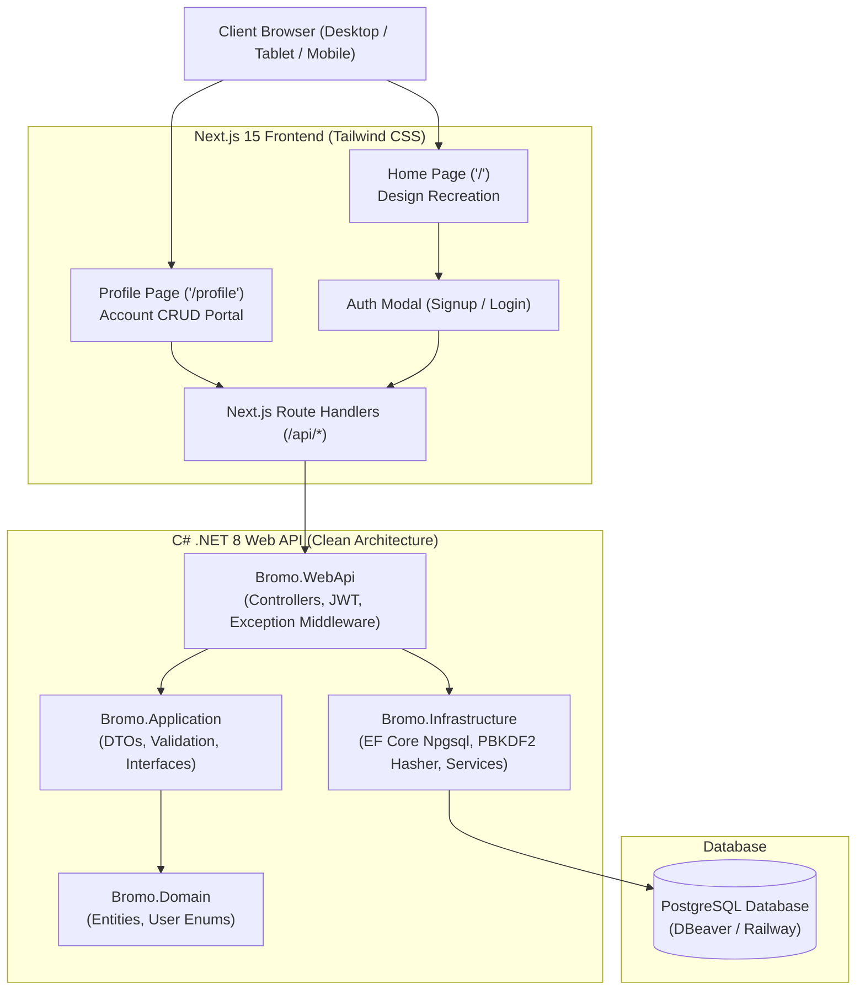

# Wanderlush — Magic of Bromo (Technical Assessment)

A modern full-stack travel and expedition application featuring the **Magic of Bromo**, built to fulfill the technical assessment requirements:
1. **Task 1 – UI Development**: Pixel-accurate recreation of the Bromo design reference with responsive layout across mobile, tablet, and desktop using **Next.js** and **Tailwind CSS**.
2. **Task 2 – Account CRUD Application**: A complete user account management system powered by a **C# .NET Clean Architecture** backend and **PostgreSQL** database, featuring full CRUD operations, JWT authentication, and an interactive `/profile` portal.
3. **Deployment**: Production deployment blueprint for **Railway** (Next.js Frontend + C# Backend + PostgreSQL Database).

---

## 🏛️ System Architecture



### Clean Architecture Layers:
- **`Bromo.Domain`**: Core entities (`User`), enums (`UserRole`), base entities, and domain logic.
- **`Bromo.Application`**: Application contracts (`IAuthService`, `IUserService`), DTOs, custom exceptions (`NotFoundException`, `ValidationException`).
- **`Bromo.Infrastructure`**: EF Core database implementation (`ApplicationDbContext`), PostgreSQL mappings, PBKDF2 password hashing, JWT generator.
- **`Bromo.WebApi`**: REST controllers (`AuthController`, `UsersController`), Swagger/OpenAPI documentation, JWT authentication middleware, global exception handler.

---

## 📋 Feature Breakdown

### Task 1: UI Recreation (`/`)
- **Hero Section**: Sunrise caldera imagery, responsive typography, social links, booking triggers, and schedule drawer.
- **The Journey of Bromo**: Curated itineraries (Kingkong Hill sunrise, Sea of Sand, Crater Ascent, Savannah).
- **Villas & Hotels**: Interactive search filters (Dates, Budget, Guests) and villa reservation system.
- **Caldera Explorer**: Interactive volcanic chain map with peak markers (Bromo, Batok, Kursi, Widodaren).
- **Travel Blog & Modals**: Cultural guides, gear checklists, video tour player, and toast notifications.
- **Responsiveness**: Tailored layouts for smartphone portrait, tablet, and widescreen desktop.

### Task 2: Account CRUD Operations (`/profile` & Modals)
| Operation | HTTP Method | Endpoint | Description |
| :--- | :--- | :--- | :--- |
| **Create** | `POST` | `/api/auth/register` | Register new user with full name, email, password, phone |
| **Login** | `POST` | `/api/auth/login` | Authenticate credentials and receive secure JWT token |
| **Read** | `GET` | `/api/users/profile` | Retrieve authenticated user's profile and metadata |
| **Update** | `PUT` | `/api/users/profile` | Update full name, phone number, bio, avatar URL |
| **Password** | `PUT` | `/api/users/change-password` | Verify current password and apply new password hash |
| **Delete** | `DELETE` | `/api/users/account` | Permanently remove the user account from PostgreSQL |

---

## 🛠️ Prerequisites

Ensure you have the following installed locally:
- **Node.js**: v18.18+ or v20+ (`node -v`)
- **.NET SDK**: .NET 8.0 or .NET 9.0 (`dotnet --version`)
- **PostgreSQL**: 14, 15, or 16 (Local, Docker, or Railway Cloud DB)
- **DBeaver**: Community or Enterprise ([Download DBeaver](https://dbeaver.io/))

---

## 🗄️ Database Setup & Migration (DBeaver & PostgreSQL)

### Step 1: Connect DBeaver to PostgreSQL
1. Open **DBeaver** and click **New Database Connection** (Plug icon).
2. Choose **PostgreSQL** and click **Next**.
3. Fill in connection details:
   - **Host**: `localhost` (or your remote database host)
   - **Port**: `5432`
   - **Database**: `postgres` (or `bromo_wanderlush_db`)
   - **Username**: `postgres`
   - **Password**: *Your PostgreSQL password*
4. Click **Test Connection** (DBeaver will prompt to download drivers if needed) and click **Finish**.

### Step 2: Create the Database
Right-click your PostgreSQL connection in DBeaver -> **SQL Editor > New SQL Script**:
```sql
CREATE DATABASE bromo_wanderlush_db;
```
Press `Ctrl + Enter` to execute.

### Step 3: Run the Schema Migration Script
1. Open the file [`backend/scripts/init_postgres.sql`](backend/scripts/init_postgres.sql) in DBeaver.
2. Ensure active database is set to `bromo_wanderlush_db`.
3. Press `Alt + X` (or click **Execute SQL Script**).
4. This creates:
   - `users` table with UUID primary key and audit timestamps.
   - Case-insensitive unique index on `email`.
   - Automatic `updated_at_utc` trigger.
   - Pre-seeded demo user: `aris.traveler@wanderlush.com` (Password: `Bromo2026!`).

---

## 🚀 Running the Project Locally

### 1. Start the C# Backend API
1. Navigate to the Web API directory:
   ```bash
   cd backend/Bromo.WebApi
   ```
2. Verify or update your connection string in `appsettings.json`:
   ```json
   {
     "ConnectionStrings": {
       "DefaultConnection": "Host=localhost;Port=5432;Database=bromo_wanderlush_db;Username=postgres;Password=YOUR_PASSWORD;Include Error Detail=true;"
     }
   }
   ```
3. Run the backend:
   ```bash
   dotnet run
   ```
4. The API will start on:
   - **Swagger UI**: `http://localhost:5000` or `https://localhost:5001`
   - Test endpoints directly in Swagger!

### 2. Start the Next.js Frontend
1. Open a new terminal in the root directory:
   ```bash
   npm install
   ```
2. (Optional) Create `.env.local` to point to the backend:
   ```env
   DOTNET_API_URL=http://localhost:5000
   ```
   *(Note: If the C# backend is not running, the frontend includes an in-memory persistence fallback to allow testing without local .NET setup)*.
3. Start development server:
   ```bash
   npm run dev
   ```
4. Open [http://localhost:3000](http://localhost:3000) in your browser.

---

## 🚂 Railway Deployment Guide

This project is pre-configured for 1-click deployment on [Railway](https://railway.com/).

### Architecture on Railway:
1. **PostgreSQL Service**: Railway managed database.
2. **C# Backend Service**: Deployed from `backend/Dockerfile`.
3. **Next.js Frontend Service**: Deployed from repository root.

### Step 1: Deploy PostgreSQL Database on Railway
1. Log in to [Railway](https://railway.com/) and click **+ New Project**.
2. Select **Provision PostgreSQL**.
3. Once provisioned, click the PostgreSQL service, go to **Connect**, and copy the **`DATABASE_URL`** or **Public Connection URL**.
4. *(Optional via DBeaver)*: Connect DBeaver using the public host, port, and credentials from Railway, then execute [`backend/scripts/init_postgres.sql`](backend/scripts/init_postgres.sql) to seed the database.
   *(Note: The C# backend will also automatically run `EnsureCreated()` on boot if connected).*

### Step 2: Deploy C# Backend on Railway
1. In the same Railway project, click **+ Create > GitHub Repo** and select this repository.
2. Go to the new service **Settings**:
   - **Root Directory**: `backend` (Railway detects `backend/Dockerfile`).
3. Go to **Variables** and add:
   - `DATABASE_URL`: `${{Postgres.DATABASE_URL}}` (Railway references the Postgres service directly).
   - `JwtSettings__SecretKey`: `YourSuperSecretJwtKeyForBromoExplorations2026!#MustBeLong`
   - `JwtSettings__Issuer`: `BromoApi`
   - `JwtSettings__Audience`: `BromoClient`
4. Under **Settings > Networking**, click **Generate Domain** (e.g., `https://bromo-backend-production.up.railway.app`).

### Step 3: Deploy Next.js Frontend on Railway
1. In the same project, click **+ Create > GitHub Repo** and select this repository again.
2. In **Settings**:
   - **Root Directory**: Leave blank (root `/`). Railway automatically detects Next.js.
3. In **Variables**:
   - `DOTNET_API_URL`: Your backend URL from Step 2 (e.g., `https://bromo-backend-production.up.railway.app`).
4. In **Settings > Networking**, click **Generate Domain** (e.g., `https://wanderlush-bromo-production.up.railway.app`).
5. Open your live Next.js URL and test Signup, Login, and `/profile` CRUD!

---

## 🧪 Demo Credentials for Evaluators

For instant evaluation, you can use the pre-seeded account:
- **Email**: `aris.traveler@wanderlush.com`
- **Password**: `Bromo2026!`
- Or simply click the **"Quick Demo Sign In"** button on the Sign In modal!

---

## 📁 Repository Structure

```text
wanderlush---magic-of-bromo/
├── app/
│   ├── api/                    # Next.js API route proxies to C# backend
│   │   ├── auth/               # /api/auth/register, /api/auth/login, /api/auth/me
│   │   └── users/              # /api/users/profile, /api/users/account, change-password
│   ├── globals.css             # Tailwind CSS styles
│   ├── layout.tsx              # Root HTML & Providers
│   ├── page.tsx                # Task 1: Recreated Home Page ('/')
│   └── profile/
│       └── page.tsx            # Task 2: Account CRUD Profile Portal ('/profile')
├── backend/
│   ├── Bromo.CleanArchitecture.sln
│   ├── Dockerfile              # Multi-stage production container for Railway
│   ├── Bromo.Domain/           # Entities, Enums (User, Role)
│   ├── Bromo.Application/      # DTOs, Interfaces, Exceptions
│   ├── Bromo.Infrastructure/   # EF Core Npgsql, Auth, PasswordHasher
│   ├── Bromo.WebApi/           # REST Controllers, JWT Middleware, Swagger
│   └── scripts/
│       ├── init_postgres.sql   # PostgreSQL table, trigger, & seed script
│       └── DBeaver_PostgreSQL_Setup_Guide.md # Step-by-step DBeaver guide
├── components/                 # Responsive UI components & modals
│   ├── Navbar.tsx              # Navigation with auth status & mobile drawer
│   ├── Hero.tsx                # Hero section with CTA & social links
│   ├── JourneySection.tsx      # Expedition itineraries
│   ├── VillasSection.tsx       # Booking & hotel cards with filters
│   ├── AerialCalderaSection.tsx# Interactive volcano peaks explorer
│   ├── BlogSection.tsx         # Articles & cultural stories
│   ├── AuthModal.tsx           # Signup & Login modal with live validation
│   └── Footer.tsx              # Newsletter & footer columns
├── context/
│   └── AuthContext.tsx         # React authentication state & token manager
├── lib/
│   └── authService.ts          # API client for .NET backend communication
└── README.md                   # Documentation & submission guide
```
